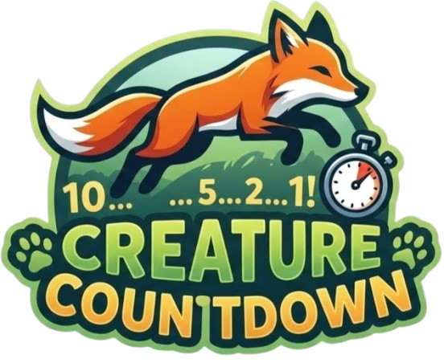

# 🦊 Creature Countdown

<p align="center">
  
</p>


A fast-paced animal naming game where you race against time to list as many animals as you can!

## 🎮 Game Overview

Creature Countdown challenges players to type as many animal names as possible before time runs out. Each correct animal adds bonus time to your clock, creating an exciting race against the countdown timer.

## ✨ Features

- **5,000+ Animals Database** - Extensive collection of real animals to discover
- **Dynamic Timer** - Earn bonus time with each correct answer
- **Smart Validation** - Prevents overlapping terms (e.g., "bear" and "polar bear")
- **Searchable Database** - Browse the complete animal database
- **Dark/Light/System Themes** - Choose your preferred visual style
- **Customizable Settings** - Adjust initial time, time bonuses, and animations
- **Dramatic Timer Animation** - Timer scales dramatically when under 10 seconds
- **Game Statistics** - View your score and animal list at the end

## 🚀 Getting Started

### Local Development
Simply open `index.html` in any modern web browser. No installation or build process required!

### Docker Deployment
The Docker image is automatically built and published to GitHub Container Registry via CI/CD.

Run with Docker Compose:
```bash
docker-compose up -d
```
Access the game at `http://localhost:3991`

## 🎯 How to Play

1. Click "Start Game" to begin
2. Type animal names into the input field
3. Press Enter or click Submit to validate each animal
4. Keep going until time runs out!
5. Share your score and animal list

### Rules

- Animals must be from the 5,000+ animal database
- No overlapping terms allowed (e.g., you can't list both "bear" and "polar bear")
- Each correct animal adds bonus time to the clock
- Game ends when the timer reaches zero

## ⚙️ Settings

Customize your experience:
- **Theme**: System, Light, or Dark mode
- **Initial Time**: Set starting time (10-300 seconds)
- **Time Increment**: Bonus time per animal (1-30 seconds)
- **Animations**: Toggle background animations

## 🛠️ Technical Details

Built with pure vanilla JavaScript, HTML5, and CSS3. No frameworks or dependencies required.

### Files

- `index.html` - Main game structure
- `styles.css` - All styling and animations
- `script.js` - Game logic and 5,000-animal database
- `logo.png` - Game logo
- `timer-demo.html` - Timer animation demo page
- `Dockerfile` - Container configuration using Caddy
- `docker-compose.yml` - Docker Compose deployment
- `Caddyfile` - Caddy web server configuration

### Browser Compatibility

Works in all modern browsers that support:
- CSS Grid & Flexbox
- CSS Custom Properties (CSS Variables)
- LocalStorage API
- ES6+ JavaScript

## 🎨 Features in Detail

### Theme Support
Automatically adapts to your system's dark/light mode preference, or manually choose your preferred theme. Settings persist across sessions.

### Database Viewer
Click the 📚 button in settings to browse all 5,000 animals. Includes real-time search filtering.

### Timer Animation
When time drops below 10 seconds, the countdown timer dramatically scales up and pulses in red to create urgency.

## 📝 License

MIT License - feel free to use this code for your own projects!

## 🙏 Credits

Inspired by [Animalist](https://rose.systems/animalist/) by Vivian Rose.

Created as a tribute to the original game with expanded features and customization options.

---

**Version:** 1.0.12

Enjoy playing Creature Countdown! 🦁🐯🐻
